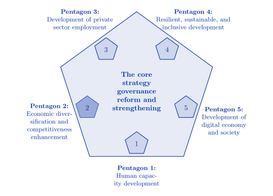

```{r, setup, include=FALSE}
knitr::opts_chunk$set(echo = F, fig.align="center")
```

### Purpose

កំណែជាភាសាខ្មែរនៃកម្មវិធីនេះមាននៅ <https://evans-par.shinyapps.io/agquery-khm>

The Data Explorer supports progress tracking, reporting, and hypothesis testing to facilitate decision making related to the [Cambodian Government's 2023 Pentagonal Strategy](https://mfaic.gov.kh/files/uploads/1XK1LW4MCTK9/EN%20PENTAGONAL%20STRATEGY%20-%20PHASE%20I.pdf)'s goals, including modernization, increasing productivity in priority crops and domestic livestock, strengthening extension services, and increasing agricultural products processing industries, furthering implementation of the [National Agricultural Development Policy](https://data.opendevelopmentcambodia.net/library_record/national-agricultural-development-policy-2022-2023) and [Cambodia Agro-Industrial Development Strategic Plan](https://faolex.fao.org/docs/pdf/cam219302.pdf), which aim to increase domestic commercial livestock production and the domestic agricultural products processing industries.

<div align="center">

</div>

In collaboration with app maintainers, the users are able to view, analyze, and create figures related to household production of crops and livestock that can be used to understand trends in small-scale producer contributions to national supply and the economic conditions small-scale producers face. Variables in the survey are grouped according to policy themes for ease of navigation.

### Value Addition to the Data Analysis Process

The 50x30 Cambodia Data Explorer bridges the gap between survey data collection and policy decisionmaking. It provides the opportunity to combine knowledge from scholarly research in agricultural policy with observed trends in variables collected in the field. These trends can inform progress toward established goals or aid in the formation of new programs. The results of those policies become visible in new data collection, which is added through updates.

<div align="center">
{width=70%}
</div>

### Flexible and Open-Source

AgQuery distinguishes itself from other data analysis tools in the following ways:

-   **Policy Context:** With policy expertise from EPAR and other stakeholders, this data explorer adds a new dimension to data visualization by taking into account Cambodia’s specific policy-context.

    - It focuses on visualizing data according to the Cambodian Ministry of Agriculture’s domestic policy priorities, which can be updated to suit changing needs.

    - Not only does our explorer align with the ministry, but it also provides specific policy pathways through which progress can be tracked and measured.

-   **Open-source platform:**The code for developing the website is open-source. It is free of charge and publicly available to modify or reuse.

-   **Customizable Data:** Data can be easily modified, extended, or replaced as new surveys are released without requiring modifications to the code.

### Using the Cambodia Agricultural Survey Policy & Data Explorer

#### Policy Goals and Instruments

-   This tab provides a detailed overview of the policy priorities currently in the app. Policy instruments for achieving each goal are evaluated with respect to the effects on producer interaction with the market. The list can be modified by editing an Excel sheet.

#### Variable Maps and Statistics

-   This tab shows summary statistics (weighted means or totals), year-over-year changes, and spatial distributions of variables related to the policy goals. Begin by selecting a policy goal, then optionally choose an instrument to show the most relevant variables for that instrument. Maps illustrate the province-level means as of the most recent survey and the change in means since the previous survey.

#### Variable Correlations

-   This tab contains a heatmap showing levels of correlation across variables and the option to make histograms, maps, and scatter plots. Users can also download raw data for follow-up analyses.

#### Secondary Data Sources

-   This tab contains a table of policy documents, literature citations, and additional sources of useful data, such as import/export statistics, exchange rates, and food balances.

#### User Guide

-   This tab provides step-by-step instructions, tips, and frequently asked questions (FAQs) about the data explorer.


### Code and Data Availability

-   The Stata code used to process the data is publicly available at <https://github.com/EvansSchoolPolicyAnalysisAndResearch/CAS-Data-Preparation>.

-   The app source code and related files can be downloaded at <https://github.com/EvansSchoolPolicyAnalysisAndResearch/50x30_AQP>

-   The raw data for the Cambodia Agricultural Survey survey are located at <https://nada.nis.gov.kh/index.php/catalog/36>.

### Inquire

This tool is currently maintained by the Evans Policy Analysis and Research group at the University of Washington. Please reach out via the GitHub repository with questions or bug reports.

### Citation

If you use this app for scholarly research or modify it for alternative uses, please use this attribution:

University of Washington, Evans Policy Analysis and Research (EPAR) (2024). Cambodia Agricultural Survey Policy & Data Explorer. v0.2. DOI: <https://doi.org/10.6069/GPPQ-2X85>

{width="435"}
