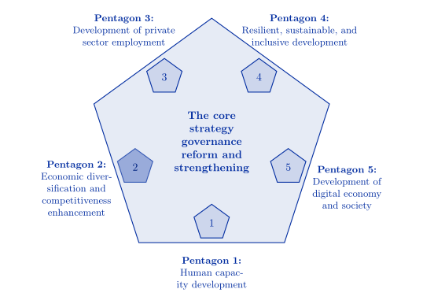

```{r, setup, include=FALSE}
knitr::opts_chunk$set(echo = F, fig.align="center")
```

### Purpose

```{r}
#កំណែជាភាសាខ្មែរនៃកម្មវិធីនេះមាននៅ <https://evans-par.shinyapps.io/agquery-khm>
#Temporarily commenting out link to Khmer version pending full translation.
```
  
អ្នករុករកទិន្នន័យគាំទ្រការតាមដានវឌ្ឍនភាព ការរាយការណ៍ និងការធ្វើតេស្តសម្មតិកម្ម ដើម្បីជួយសម្រួលដល់ការសម្រេចចិត្តទាក់ទងនឹងគោលដៅនៃ [យុទ្ធសាស្ត្រមន្ទីរបញ្ចកោណឆ្នាំ 2023 របស់រដ្ឋាភិបាលកម្ពុជ](https://mfaic.gov.kh/files/uploads/1XK1LW4MCTK9/EN%20PENTAGONAL%20STRATEGY%20-%20PHASE%20I.pdf) ការកើនឡើងនូវគោលដៅទំនើបកម្ម ផលិតភាពក្នុងដំណាំជាអាទិភាព និងបសុសត្វក្នុងស្រុក ការពង្រឹងសេវាកម្មផ្នែកបន្ថែម និងការបង្កើនឧស្សាហកម្មកែច្នៃផលិតផលកសិកម្ម ការអនុវត្តបន្ថែមទៀតនៃ [គោលនយោបាយអភិវឌ្ឍន៍កសិកម្មជាតិ](https://data.opendevelopmentcambodia.net/library_record/national-agricultural-development-policy-2022-2023) និង [ផែនការយុទ្ធសាស្ត្រអភិវឌ្ឍន៍កសិឧស្សាហកម្មកម្ពុជា។](https://faolex.fao.org/docs/pdf/cam219302.pdf) ដែលមានបំណងបង្កើនផលិតកម្មសត្វចិញ្ចឹមក្នុងស្រុក និងឧស្សាហកម្មកែច្នៃផលិតផលកសិកម្មក្នុងស្រុក។

<div align="center">

</div>

ដោយសហការជាមួយអ្នកថែទាំកម្មវិធី អ្នកប្រើប្រាស់អាចមើល វិភាគ និងបង្កើតតួរលេខទាក់ទងនឹងការផលិតដំណាំ និងបសុសត្វក្នុងគ្រួសារ ដែលអាចត្រូវបានប្រើដើម្បីយល់ពីនិន្នាការនៃការរួមចំណែករបស់អ្នកផលិតខ្នាតតូចចំពោះការផ្គត់ផ្គង់ជាតិ និងលក្ខខណ្ឌសេដ្ឋកិច្ចដែលផលិតករខ្នាតតូចប្រឈមមុខ។

អថេរ​ក្នុង​ការ​ស្ទង់មតិ​ត្រូវ​បាន​ដាក់​ជា​ក្រុម​តាម​ប្រធានបទ​គោល​នយោបាយ​សម្រាប់​ភាព​ងាយ​ស្រួល​ក្នុង​ការ​រុករក។


### ការបន្ថែមតម្លៃទៅលើដំណើរការវិភាគទិន្នន័យ

អ្នករុករកទិន្នន័យស្ទាបស្ទង់កសិកម្មកម្ពុជា បង្រួបបង្រួមគម្លាតរវាងការប្រមូលទិន្នន័យស្ទង់មតិ និងការសម្រេចគោលនយោបាយ។ វាផ្តល់ឱកាសដើម្បីបញ្ចូលគ្នានូវចំណេះដឹងពីការស្រាវជ្រាវរបស់អ្នកប្រាជ្ញនៅក្នុងគោលនយោបាយកសិកម្មជាមួយនឹងនិន្នាការដែលបានសង្កេតឃើញនៅក្នុងអថេរដែលប្រមូលបាននៅក្នុងវិស័យនេះ។ និន្នាការទាំងនេះអាចជូនដំណឹងអំពីវឌ្ឍនភាពឆ្ពោះទៅរកគោលដៅដែលបានបង្កើតឡើង ឬជំនួយក្នុងការបង្កើតកម្មវិធីថ្មី។ លទ្ធផលនៃគោលការណ៍ទាំងនោះអាចមើលឃើញនៅក្នុងការប្រមូលទិន្នន័យថ្មី ដែលត្រូវបានបន្ថែមតាមរយៈការធ្វើបច្ចុប្បន្នភាព។

<div align="center">
{width=70%}
</div>

### អាចបត់បែនបាន និងប្រភពបើកចំហ

អ្នករុករកទិន្នន័យសម្គាល់ខ្លួនវាពីឧបករណ៍វិភាគទិន្នន័យផ្សេងទៀតតាមវិធីដូចខាងក្រោមៈ

-   **បរិបទគោលនយោបាយ៖** ជាមួយនឹងអ្នកជំនាញខាងគោលនយោបាយពី EPAR និងអ្នកពាក់ព័ន្ធផ្សេងទៀត អ្នករុករកទិន្នន័យនេះបន្ថែមវិមាត្រថ្មីដល់ការមើលឃើញទិន្នន័យដោយគិតគូរពីបរិបទគោលនយោបាយជាក់លាក់របស់កម្ពុជា។

    - វាផ្តោតលើការមើលឃើញទិន្នន័យស្របតាមអាទិភាពគោលនយោបាយក្នុងស្រុករបស់ក្រសួងកសិកម្មកម្ពុជា ដែលអាចធ្វើបច្ចុប្បន្នភាពដើម្បីបំពេញតម្រូវការផ្លាស់ប្តូរ។

    - អ្នករុករករបស់យើងមិនត្រឹមតែតម្រឹមជាមួយក្រសួងប៉ុណ្ណោះទេ ប៉ុន្តែវាក៏ផ្តល់នូវផ្លូវគោលនយោបាយជាក់លាក់ដែលតាមរយៈវឌ្ឍនភាពអាចត្រូវបានតាមដាន និងវាស់វែងផងដែរ។

-   ** វេទិកាប្រភពបើកចំហ៖ ** កូដសម្រាប់បង្កើតគេហទំព័រគឺជាប្រភពបើកចំហ។ វាមិនគិតថ្លៃទេ ហើយមានជាសាធារណៈដើម្បីកែប្រែ ឬប្រើឡើងវិញ។

-   **ទិន្នន័យដែលអាចប្ដូរតាមបំណងបាន៖** ទិន្នន័យអាចត្រូវបានកែប្រែ ពង្រីក ឬជំនួសបានយ៉ាងងាយស្រួល នៅពេលដែលការស្ទង់មតិថ្មីត្រូវបានចេញផ្សាយ ដោយមិនចាំបាច់មានការកែប្រែកូដនោះទេ។

### ការប្រើប្រាស់គោលនយោបាយស្ទង់មតិកសិកម្មកម្ពុជា & អ្នករុករកទិន្នន័យ

#### គោលដៅគោលនយោបាយ និងឧបករណ៍

-   ផ្ទាំងនេះផ្តល់នូវទិដ្ឋភាពទូទៅលម្អិតនៃអាទិភាពគោលនយោបាយបច្ចុប្បន្ននៅក្នុងកម្មវិធី។ ឧបករណ៍គោលនយោបាយសម្រាប់ការសម្រេចបាននូវគោលដៅនីមួយៗត្រូវបានវាយតម្លៃទាក់ទងនឹងផលប៉ះពាល់លើអន្តរកម្មរបស់អ្នកផលិតជាមួយទីផ្សារ។ បញ្ជីអាចត្រូវបានកែប្រែដោយការកែសម្រួលសន្លឹក Excel ។

#### ផែនទី និងស្ថិតិអថេរ

-   ផ្ទាំងនេះបង្ហាញស្ថិតិសង្ខេប (មធ្យោបាយដែលមានទម្ងន់ ឬសរុប) ការផ្លាស់ប្តូរពីមួយឆ្នាំទៅមួយឆ្នាំ និងការចែកចាយទំហំនៃអថេរដែលទាក់ទងនឹងគោលដៅគោលនយោបាយ។ ចាប់ផ្តើមដោយជ្រើសរើសគោលដៅគោលនយោបាយ បន្ទាប់មកជ្រើសរើសឧបករណ៍ដើម្បីបង្ហាញអថេរដែលពាក់ព័ន្ធបំផុតសម្រាប់ឧបករណ៍នោះ។ ផែនទីបង្ហាញពីមធ្យោបាយកម្រិតខេត្ត តាមការស្ទង់មតិចុងក្រោយបំផុត និងការផ្លាស់ប្តូរមធ្យោបាយចាប់តាំងពីការស្ទង់មតិមុន។

#### ទំនាក់ទំនងអថេរ

-   ផ្ទាំងនេះមានផែនទីកំដៅដែលបង្ហាញពីកម្រិតនៃការជាប់ទាក់ទងគ្នានៅទូទាំងអថេរ និងជម្រើសដើម្បីបង្កើតអ៊ីស្តូក្រាម ផែនទី និងគ្រោងការខ្ចាត់ខ្ចាយ។ អ្នកប្រើប្រាស់ក៏អាចទាញយកទិន្នន័យឆៅសម្រាប់ការវិភាគតាមដានផងដែរ។

#### ប្រភពទិន្នន័យបន្ទាប់បន្សំ

-   ផ្ទាំងនេះមានតារាងឯកសារគោលនយោបាយ ការដកស្រង់អក្សរសិល្ប៍ និងប្រភពបន្ថែមនៃទិន្នន័យមានប្រយោជន៍ ដូចជាស្ថិតិនាំចូល/នាំចេញ អត្រាប្តូរប្រាក់ និងសមតុល្យអាហារ។

#### ការណែនាំអ្នកប្រើប្រាស់

-   ផ្ទាំងនេះផ្តល់នូវការណែនាំជាជំហានៗ គន្លឹះ និងសំណួរដែលគេសួរញឹកញាប់ (FAQ) អំពីកម្មវិធីរុករកទិន្នន័យ។


### ភាពអាចរកបាននៃកូដ និងទិន្នន័យ

-   លេខកូដ Stata ដែលប្រើដើម្បីដំណើរការទិន្នន័យមានជាសាធារណៈនៅ <https://github.com/EvansSchoolPolicyAnalysisAndResearch/CAS-Data-Preparation>.

-  កូដប្រភពកម្មវិធី និងឯកសារពាក់ព័ន្ធអាចទាញយកបាននៅ <https://github.com/EvansSchoolPolicyAnalysisAndResearch/50x30_AQP>

-   ទិន្នន័យ​ដើម​សម្រាប់​ការ​អង្កេត​កសិកម្ម​កម្ពុជា​មាន​ទីតាំង​នៅ​ឯ <https://nada.nis.gov.kh/index.php/catalog/36>.

### សាកសួរ

បច្ចុប្បន្នឧបករណ៍នេះត្រូវបានរក្សាទុកដោយក្រុមវិភាគ និងស្រាវជ្រាវគោលនយោបាយ Evans នៅសាកលវិទ្យាល័យវ៉ាស៊ីនតោន។ សូមទាក់ទងតាមរយៈ [ឃ្លាំង GitHub](https://github.com/EvansSchoolPolicyAnalysisAndResearch/50x30_AQP/issues) ជាមួយនឹងសំណួរ ឬរបាយការណ៍បញ្ហា។

### ការដកស្រង់

ប្រសិនបើអ្នកប្រើកម្មវិធីនេះសម្រាប់ការសិក្សាស្រាវជ្រាវ ឬកែប្រែវាសម្រាប់ការប្រើប្រាស់ជំនួស សូមប្រើគុណលក្ខណៈនេះ៖

University of Washington, Evans Policy Analysis and Research (EPAR) (2024). Cambodia Agricultural Survey Policy & Data Explorer. v0.2. DOI: <https://doi.org/10.6069/GPPQ-2X85>

{width="435"}
